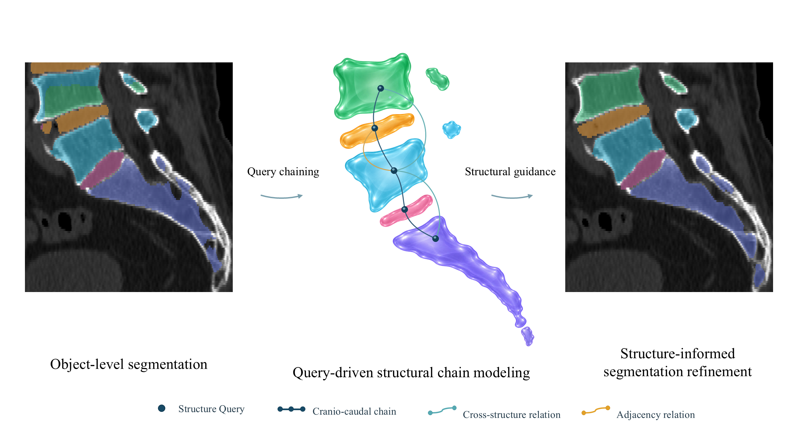
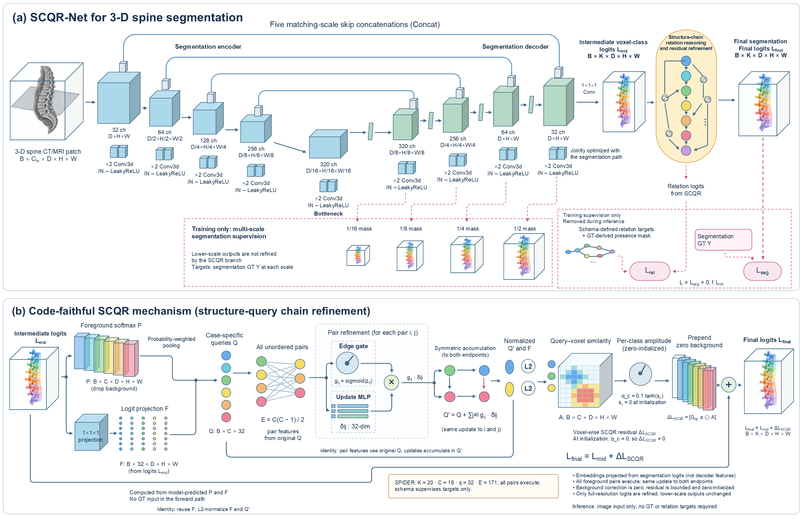

# SCQR-Net

SCQR-Net (**Structure-Chain Query Refinement Network**) is an end-to-end
framework for structure-informed spine image segmentation. Instead of treating
the target anatomy as a collection of independent foreground objects, SCQR-Net
organizes the predicted structures through their relative cranio-caudal order,
continuity, adjacency and cross-structure relations. The resulting structural
information is projected back to the voxel grid to refine the segmentation.



## Core idea

Given a volumetric image, a segmentation backbone first produces intermediate
multi-class logits. SCQR-Net then performs five operations within the same
forward pass:

1. **Case-specific Structure Queries.** The predicted probability of each
   foreground structure is used to pool a query from the current case.
2. **Pairwise relation prediction.** Candidate query pairs are assigned learned
   relation strengths under a dataset-specific structural schema.
3. **Relation-enhanced queries.** Pairwise messages update the query of each
   structure using evidence from associated structures.
4. **Voxel-space projection.** Enhanced queries are matched with voxel features
   to convert structure-level reasoning into spatial correction maps.
5. **Bounded residual refinement.** A zero-initialized, structure-specific scale
   controls the residual added to each foreground logit channel. The background
   channel is unchanged.



The complete network is optimized using a segmentation objective and an
auxiliary relation-classification objective. Ground-truth masks and structural
relation targets are used only to compute training losses. Inference requires
only the input image.

## End-to-end training

SCQR-Net is trained end to end from random initialization. The segmentation
backbone, Structure Query pathway, relation module and residual refinement
module are jointly optimized within a single network. The repository does not
contain or execute checkpoint loading.

The refinement scale is initialized to zero. At the beginning of optimization,
the SCQR residual path therefore does not perturb the backbone logits, and its
contribution is learned progressively through backpropagation.

## Dataset-independent structural modeling

The same computation applies to datasets with different label systems. Each
dataset supplies a relation schema defining valid foreground nodes and positive
relations, while Query extraction, relation enhancement, voxel projection and
residual refinement remain unchanged. The framework therefore relies on
relative structural organization rather than requiring a shared set of
absolute anatomical names across datasets.

For example, a dataset may represent ordered vertebral instances, ordered disc
instances and the spinal canal. Their relative order, continuity and
canal-to-segment associations are sufficient to instantiate a structural chain.

## Minimal example

```python
from scqr import AdaptiveQueryChain, RelationSchema, adaptive_loss

schema = RelationSchema(
    num_foreground=NUM_FOREGROUND,
    positive_pairs=VERIFIED_RELATION_PAIRS,
)

# The segmentation backbone is randomly initialized and trained jointly.
model = AdaptiveQueryChain(
    base=segmentation_backbone,
    num_classes=NUM_CLASSES,
    schema=schema,
    query_dim=QUERY_DIM,
    correction_limit=CORRECTION_LIMIT,
)

output = model(images)
losses = adaptive_loss(
    model=model,
    output=output,
    target=targets,
    segmentation_loss=segmentation_loss,
    relation_weight=RELATION_WEIGHT,
    present_mask=present_structure_mask,
)
losses["loss"].backward()
optimizer.step()
```

## Repository layout

- `scqr/`: reusable model core, relation schema and loss functions.
- `training/`: framework-neutral integration skeleton.
- `evaluation/`: callback-based evaluation interface.
- `tests/`: synthetic tests for tensor shapes and zero-initialized refinement.
- `adaptive_query_chain_template.py`: backward-compatible import entry point.
- `assets/`: conceptual and architectural figures used in this README.

## Scope of the public template

This repository provides the dataset-independent SCQR computation and its loss
functions. Dataset preparation, clinical data, label definitions, concrete
relation schemas, private paths, data splits and experiment-specific training
or evaluation pipelines are not included.
